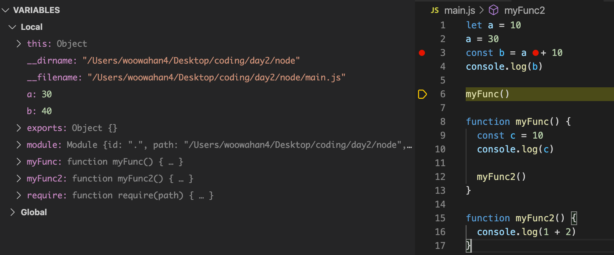
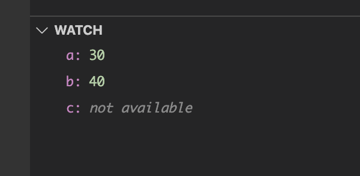
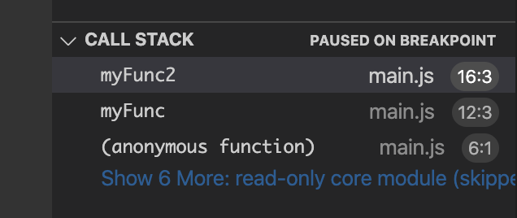
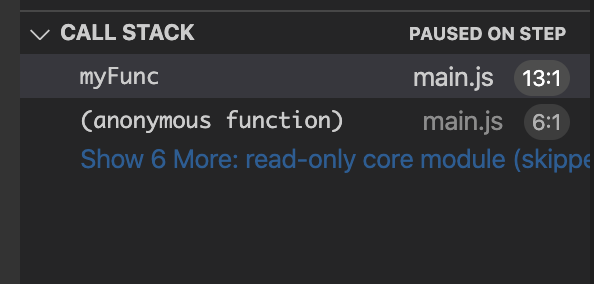
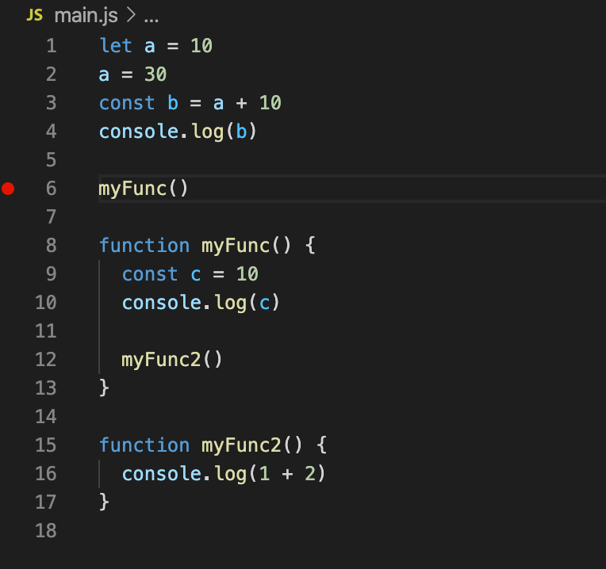

## breakpoints란

+ 디버깅을 목적으로 실행중인 디버깅 대상 프로세스를 의도적으로 멈추게 하는 지점입니다
+ 사용자가 임의로 코드 옆 빈 공간을 클릭하여 breakpoints를 지정할 수 있습니다




## watch사용법

+ debugging에서 watch 탭의 `+`를 눌러서 값의 변화를 알고자하는 변수들을 추가합니다 
+ 예제 화면에서는 a, b, c를 추가했습니다
+ 아직 선언되지 않은 변수 혹은 메모리에서 제거된 변수는 unavailable이라고 표시됩니다 



## call stack 의 의미

+ 자바스크립트는 싱글 스레드 프로그래밍 언어로 함수 호출시 해당 함수에 대한 정보를 콜 스택에 저장합니다
+ 함수가 중첩되거나 재귀 함수가 실행될 때 실행할 함수가 콜스택에 쌓이고 후입선출로 빠져나가는 것을 볼 수 있습니다. 햣

```
myFunc()

function myFunc() {
  const c = 10
  console.log(c)

  myFunc2()
}

function myFunc2() {
  console.log(1 + 2)
}

```

위 예제에서 함수가 순차적으로 콜 스택에 들어갑니다

1. 가장 먼저 myFunc가 콜스택에 쌓입니다. 
2. myFunc 내부의 myFunc2가 콜스택에 쌓입니다.
3. myFunc2가 실행되고 콜스택에서 사라집니다.
4. myFunc가 실행되고 콜스택에서 사라집니다.






## Step over / Step into / Step out

+ step over : 다음 줄에 나오는 명령을 실행하고 다음 줄로 점프합니다.


+ step into: 다음 줄에 함수 호출이 포함되어 있다면 Step Into는 해당 함수로 점프하고 첫 줄에서 멈춥니다.


+ step out: 현재 함수의 나머지 부분을 실행한 다음 함수 호출 뒤 다음 명령문에서 일시 중지합니다.



